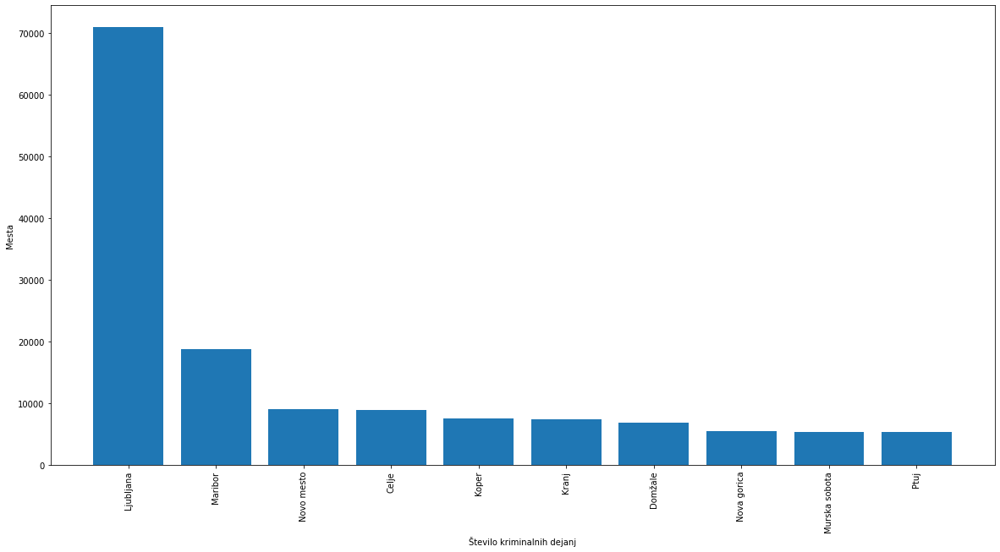
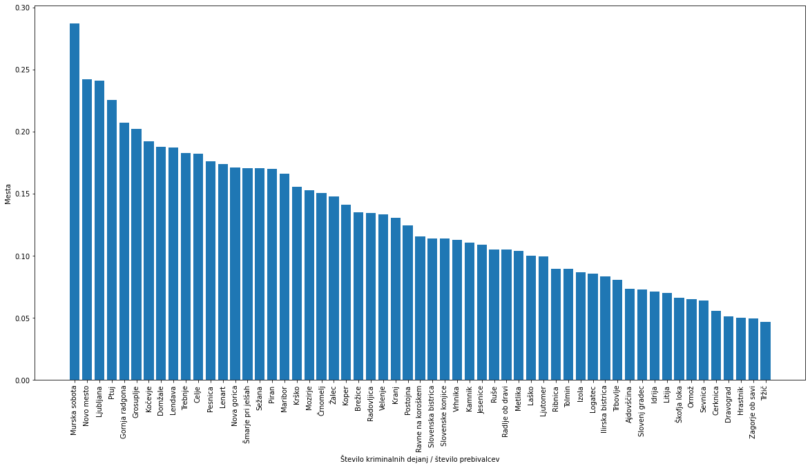
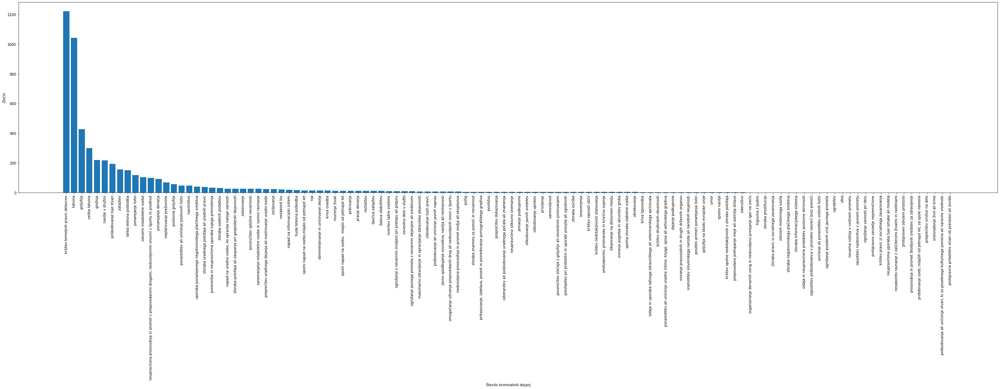
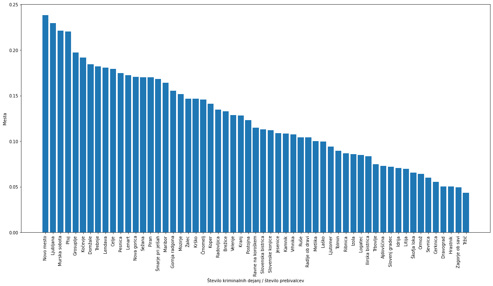

# 1. vmesno poročilo

## Opis problema
S pomočjo baze podatkov, ki opisuje pretekla kriminalna dejanja skušamo na zemljevidu prikazati čimbolj uporabne informacije o krminalu na nekem območju.  
Poleg tega bi za poljubno destinacijo na slovenskem ozemlju podali oceno varnosti lokacije.

## Opis podatkov

### Klasifikacija kaznivega dejanja
Najbolj objektivna ocena koliko je neko kaznivo dejanje "težko", je kazen, ki jo za neko dejanje prejme oseba po zakonu.  
Klasifikacija kaznivega dejanja je stolpec, ki nam poda po katerem zakonu je bila neka oseba ovadena za kaznivo dejanje.
#### Format podatkov:
- zakon/člen/odstavek/točka/alinea - tekst člena

Primer podatka: **KD02/46/1// - UMOR**  
#### Težave
- Sam zakon nam ne pove ničesar, hočemo dobiti oceno kazni za neko kaznivo dejanje.
  - Za to lahko uporabimo:
    -  maksimalno kazen, ki je predpisana po zakonu
    -  podatke o kaznih, ki so jih v preteklosti dobile osebe, ki so bile obsojene po tem zakonu.
       -  Te bodatke bomo dobili iz podatkovne množice: [Polnoletni obsojenci (znani storilci) po spolu, kaznivem dejanju in glavni kazenski sankciji (tudi pogojno obsojeni), Slovenija, letno](https://podatki.gov.si/dataset/surs1360301s)
- Podatki vsebujejo vnose iz večih različnih kazenskih zakonikov, npr. KD02 KZ01...
  - Imena kaznivih dejanj (tekst člena) se v veliki meri ujemajo med zakoniki, tako da se bomo za določanje maksimalne kazni za neko dejanje sklicevali na člene iz [trenutno veljavnega zakonika](http://pisrs.si/Pis.web/pregledPredpisa?id=ZAKO5050).
    - Vrstice kjer se imena ne ujemajo bomo izpustili...
  - Primer neujemanja med zakoniki:
    - KD02/103/1// - spolni napad na osebo, mlajšo od 14 let.
    - KZ01/173/1// - spolni napad na osebo, mlajšo od petnajst let
- Kako utežit kazni? npr. ali je bolje plačat 50.000€ ali je bolje iti v zapor za 30 dni?

## Poskus najdbe najnevarnejšega mesta s pomočjo grafov
Za reševanje tega problema smo uporabili 4 baze podatkov. Vsebujejo vsa kriminalna dejanja v letih 2018, 2019, 2020 in 2021. Prvi problem, ki smo ga opazili je, da je bilo neko kriminalno dejanje v podatkih zapisano večrat. Zato smo po obdržali le prvo pojavitev neke vrstice po stolpcu ZaporednaStevilkaKD. Nato smo prešteli pojavitve nekega mesta v podatkih. S tem smo dobili graf:

Očitno ta graf ni zelo dober, saj nebi imelo smisla, da je Ljubljana tako zelo nevarna v primerjavi z ostalimi mesti. To pa zato, ker graf prikazuje celotno število zločinov, katerih pa je v Ljubljani sigurno največ, saj je tudi populacija največja.

Zato smo se odločili vrednosti normalizirati z populacijo mesta. Torej smo za vsako mesto izračunali $vrednost=št_{zločinov\_ v\_mestu}/št_{prebivalcev\_v\_mestu}$.

Dobili smo graf:

Še vedno nam ni bilo jasno, zakaj je Murska sobota tako visoko. Zato izpišemo vrste kriminala v Murski Soboti.

Največ primerov kriminala ima vrsta kriminala: `KRŠITEV TEMELJNIH PRAVIC DELAVCEV`. Število kršitev temeljnih pravic delavcev v gornji radgoni je 1221. Delež kršitev temeljnih pravic delavcev v vseh podatkih je 0.03184342970029462. Te vrste kriminal za naš problem ne vsebujejo veliko pomena, zato ga iz vizualizacije odstranimo.

Na koncu izrišemo graf.

S tem rezultatom smo kar zadovoljni in mislimo da je dobro prikaže varnost posameznega mesta.

## Glavne ugotovitve
