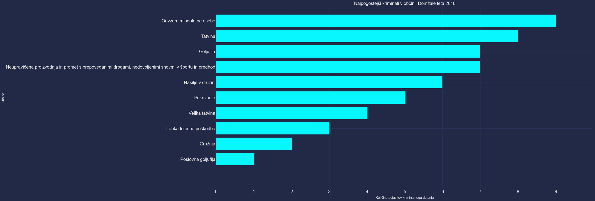

# Končno poročilo: Nevarnost Slovenije

## 1. Predstavitev problema

S pomočjo baze podatkov, ki opisuje pretekla kriminalna dejanja skušamo na zemljevidu prikazati čimbolj uporabne informacije o krminalu na nekem območju.
Poleg tega smo za poljubno destinacijo na slovenskem ozemlju podali oceno varnosti lokacije.

## 2. Opis podatkov

### Splošen opis
Podatke smo črpali iz strani iz https://podatki.gov.si/, bolj natančno https://podatki.gov.si/dataset/mnzpkazniva-dejanja-od-leta-2009-dalje. Uporabili smo podatke iz let 2018, 2019, 2020, 2021. Podatki iz let 2020 in 2021 v tej zbirki manjkajo, a smo jih našli na https://www.policija.si/o-slovenski-policiji/statistika/kriminaliteta.
Podatki vsebujejo kriminalna dejanja in razne podatke o njih. Mi smo uporabili stolpce: 
* UraStoritve
* DanVTednu
* OpisKD
* UpravnaEnotaStoritve
* OpisKraja

Poleg tega smo uporabili še [Polnoletni obsojenci (znani storilci) po spolu, kaznivem dejanju in glavni kazenski sankciji (tudi pogojno obsojeni), Slovenija, letno](https://podatki.gov.si/dataset/surs1360301s), [število prebivalcev po občinah](https://pxweb.stat.si/SiStatData/pxweb/sl/Data/-/2640010S.px) in [občine slovenije](https://sl.wikipedia.org/wiki/Seznam_ob%C4%8Din_v_Sloveniji).

### Obdelava podatkov
V podatkih za kazniva dejanja je nek zločin zapisan večrat. To je ocitno, saj se zaporedna številka kaznivega dejanja ponavlja večrat. Te duplikate smo odstranili zato, da so rezultati bolj točni. Pri tem smo vsekakor izgubili del podatkov, saj bi iz tega lahko pridobili tudi podatek, da se je zločin izvedel v skupini in bi ga mogoče lahko vzeli kot bolj nevarnega.

Vsakem kaznivem dejanju, ki se pojavi v podatkih, smo izračunali utež z enačbo: 
$$x = (max\_jailtime + avg\_actual\_jailtime) * dangerousness$$
Pomen spremenljivk v enačbi:
* $max\_jailtime$: največja zaporna kazen, ki jo obsojenec lahko prejme po zakoniku. Podatek je lahko vrednost med 0 in 100, pri katerem 100 pomeni do življenska kazen.
* $avg\_actual\_jailtime$: povprečna zaporna kazen, ki so jo v preteklosti prejeli kršitelji
* $dangerousness$: subjektivnego mnenje, kako nevarno je neko dejanje za navadnega človeka. Podatek je lahko vrednost med 0 in 1.

Da je bilo določanje uteži sploh mogoče, smo morali v podatkih formatirati stolpec "OpisKD", v katerem je zapisan člen iz kazenskega zakonika tako, da je bil enak vpisu v zakoniku.  
Primer vpisa:  
* **KZ08/204-/2/S/ - TATVINA** smo spremenili v **tatvina**  

Prav tako so nekateri vpisi bili iz zastarelih zakonikov, katere smo morali najti in spremeniti tako, da so se ujemali z vpisom v zakoniku.  
Primer vpisa:  
* **KD02/103/1// - spolni napad na osebo, mlajšo od 14 let** smo spremenili v **KZ01/173/1// - spolni napad na osebo, mlajšo od petnajst let**

Uporabili smo tudi podatke o položajih regij in občin za izris na zemljevidu v aplikaciji na Androidu. Za to smo uporabili API: [*Nominatim API*](https://nominatim.org/release-docs/latest/api/Overview).

## 3. Izvedene analize

Podnaloge, ki smo jih reševali:
* Varnost posamezne občine
* Varnost posamezne regije
* Varnost posameznega prostora
* Vpliv dneva v tednu na nevarnost
* Vpliv ure na nevarnost
* Popularnost različnih kriminalov v občinah

### 1. Varnost posamezne občine:
Najprej smo podatke prečistili po postopku, opisanim v točki 2. Nato smo zločine v vsaki občini le prešteli.  

Že takoj na prvi pogled je razvidno, da se največ zločina zgodi v Ljubljani. Sigurno pa na podlagi teh rezultatov ne moremo odgovoriti na vprašanje, "Katera občina je najbolj varna/nevarna?". Zato smo dobljene rezultate delili z številom prebivalcev v posamezni občini. Tu so bili rezultati že boljši.  

A vseeno je bilo sumjivo, da je v Murski Soboti tako veliko število zločinov. Zato smo izpisali zločine, ki so se zgodili v Murski Soboti.  

V primerjavi z drugimi je največ dejanj *Kršitev temeljnih pravic delavcev*. Za ta zločin lahko rečemo, da ni zelo nevaren za navadnega človeka, zato je kriminalna dejanja potrebno utežiti. Utežili smo jih s enačbo:  
$$x = (max\_jailtime + avg\_actual\_jailtime) * dangerousness$$
Nato pa smo izračunali nevarnost občine z enačbo:  
$$ nevarnost\_regije = \frac{\sum^n_{i=0}utež\_kaznivega\_denja_i} {število\_prebivalcev\_občine} $$
Dobimo graf:

### 2. Varnost posamezne regije:
Tu smo se že zavedali, da samo štetje kaznivih dejanj nebo dovolj, zato smo že na začetku upoštevali le utežena kriminalna dejanja.
Najprej je bilo potrebno podatke prečistiti po postopku, opisanim v točki 2. Nato pa smo ponovno za vse zločine izračunali nevarnost z enačbo:
$$x = (max\_jailtime + avg\_actual\_jailtime) * dangerousness$$

Najprej smo zapisali le vsote teh uteži kaznivih dejanj in dobili graf:  

Nato pa smo vrednosti delili še s številom prebivalcev v regiji. Končne vredsnoti so izračunane po:
$$ nevarnost\_regije = \frac{\sum^n_{i=0}utež\_kaznivega\_dejanja_i} {število\_prebivalcev\_občine} $$  

### 3. Vpliv ure na nevarnost
V podatkovni množici se nahaja stolpec "UraStoritve", v katerem je zapisana ura, kdaj se je neko kaznivo dejanje zgodilo v sledečem formatu:

- `hh:mm-hh:mm`, razpon med časoma pa je vedno ena ura, tako da je vse skupaj 24 edinstvenih vrednosti.

Naš prvotni načrt je bil grupirati te časovne razpone v **štiri** skupine:

- noč: **od 22:00 do 06:00**
- jutro: **od 06:00 do 12:00**
- popoldan: **od 12:00 do 18:00**
- večer: **od 18:00 do 22:00**

Nato pa za vsako skupino izračunati nevarnost po enačbi:  

$$nevarnost_{čas\_dneva} = \frac{\sum_{i=0}^{n}utež\_kaznivega\_dejanja_i}{count_{čas\_dneva}}, \space kjer \space je \space count_{čas\_dneva} \space število \space ur \space zajetih \space v \space skupino.$$  
Nato smo rezultate še delili z največjo dobljeno vrednostjo da smo dobili vrednosti v razponu od 0 do 1.

#### Rezultati  

Rezultati so bili morda nekoliko nepričakovani. Intuicijo smo imeli, da bo ponoči / zvečer najbolj nevarno, zares pa je najbolj nevarno zjutraj in popoldan.
Zanimalo nas je kakšen je potek nevarnosti skozi cel dan, torej kakšna je nevarnost če časovnih obdobji ne grupiramo v štiri skupine.  
Nevarnost ob neki uri smo ocenili po tej enačbi:
  $$nevarnost_{ura} = {\sum_{i=0}^{n}utež\_kaznivega\_dejanja_i}$$  
na koncu smo rezultate spet delili z maksimalno vrednostjo, da smo dobili vrednosti v razponu od 0 in 1.

### Ugotovitve
Vidimo, da je najbolj nevarno nekje okoli polnoči, a to obdobje visoke nevarnosti drži le za kakšno uro.  
Potem se od 01:00 pa do 05:00 ne dogaja skoraj nič in kot kaže je to najbolj varno časovno obdoje. Povprečno najbolj nevarno pa je čez preostali dan.  

### 4. Vpliv dneva v tednu na nevarnost
Najprej smo le prešteli zločine. Čez teden, torej od ponedeljka do petka, je bilo zločinov več, čez vikend pa manj. 
Dobljen graf:  

Nato pa sem isto izračunal še z uteženimi vrednostmi. Rezultati so bili podobni, a je bila dejanska nevarnost čez vikend večja v primerjavi z tistimi čez teden.

To je pa zato, ker je več, manj nevarnih kriminalnih dejanj čez teden kot pa čez vikend. Ko pa dejanja utežimo, pa vrednosti pridejo bolj skupaj.

Na koncu pa smo isto izračunali še za vsako občino posebaj, kar pa bomo uporabili v aplikaciji in je za prikaz nepraktično. Zapisani rezultati so v datoteki [obc_dnevi.json](https://github.com/zrezke/PR21mlfjis/blob/main/data/obc_dnevi.json).

### 5. Varnost tipov krajov (stavb)

V podatkih je tip kraja shranjen v stolpcu "OpisKraja".  
Za začetek smo izrisali kolikokrat se pojavi kateri od krajev.

Ker je eden izmed ciljev naše aplikacije tudi prikaz nevarnosti dejanskih stavb na zemljevidu smo pred določanjem nevarnosti stavb odstranili: *OpisKraja = OSTALO*, saj je OSTALO lahko bilokaj.  
Nato smo določili nevarnost na podoben način kot pri prejšnjih točkah:

  $$nevarnost_{opis\_kraja} = {\sum_{i=0}^{n}utež\_kaznivega\_dejanja_i},\space \space pri \space čemer \space je \space kaznivo\_dejanje_i, \space i-to \space kaznivo \space dejanje \space vseh \space dejanj, \space ki \space so \space se \space zgodila \space na \space istem \space opisu \space kraja$$  

Na koncu smo vrednosti še normalizirali na interval [0,1]

#### Izris nevarnosti tipov krajev

### 6. Najpogostejši kriminali v občinah  
  
Pri predstavi podatkov Y os prikazuje nazive kriminalnih dejanj.  
X os pa prikazuje zaokrožen delež pojavitve dejanja, tako da se zlahka razbere približno količino dejanj.  
  
Za primer smo vzeli najbolj pogostih 10 kriminalov za leta 2018, 2019, 2020, 2021 v občini Domžale:  
Vrednost pogostosti kriminala se normalizira s tem da se deli dejansko število dejanj z številom občanov:  
  
  
$$Normalizirana\ količina\ dejanj = \frac{dejansko\ št.\ dejanj}{št.\ občanov}$$
  

  

  

  

  
  
Opazi se nekoliko zmanjšanje kriminala v letu 2021.  
V nobenem letu se ne pojavi dejanje, ki je med 50% najbolj nevarnih dejanj, sicer bi bilo obarvano temno rožnato.  
  
Graf zgornje polovice kriminalnih dejnaj po nevarnosti dejanj (parameter je predstavljen na začetku poročila):  
  
  

## 4. Končni produkt

Na koncu pa smo iz dobljenih podatkov zasnovali aplikacijo, ki uporabniku prikaže podatke. Za prikaz zemljevida smo uporabili Google Maps API. Nato smo na ta zemljevid izrisali poligone, ki predstavljajo regije in občine. Vsi te poligoni so interaktivni in uporabnik na njih lahko pritisne. Ob pritisku se mu pokažejo statistike in pa nevarnost neke regije/mesta. Prav tako pa aplikacija omogoča prikaz nevarnosti posameznega prostora, ko uporabnik nanj pritisne.

         </img>
         </img>
         </img>
         </img>
         </img>
         </img>

